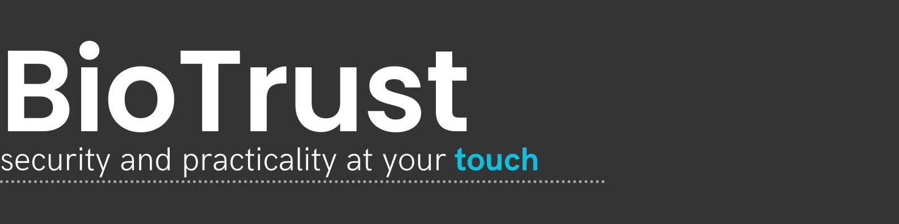

# EthSamba Hack Rio23


<p align="center">
</a>
</p>


<eng>

# Welcome to BioTrust
BioTrust is a digital identity platform that utilizes fingerprint data or infrared for individual tags to create secure and immutable digital identities stored on a blockchain. This platform ensures the integrity and verifiability of the data, allowing users to control access to the platform.
## BioTrust Team

## 👨‍🎓 Members: 
- Mariana de Paula </a>
- Heitor Cândido</a>
- Tony Jonas</a> 
- Vinicius Ibiapina</a> 

## Links
[GitHub](https://github.com/tonyJonas/BioTrust)

[Slides](https://www.canva.com/design/DAGAXez5EA0/61oIjIxe22p6x1dLkic5Rw/edit?utm_content=DAGAXez5EA0&utm_campaign=designshare&utm_medium=link2&utm_source=sharebutton)
### dApp - 

##  Technologies:
### BlockChain</a>
- **Functionality:** Blockchain is a distributed ledger technology that enables secure and transparent record-keeping.
- **Usage in Project:** In our project, blockchain technology is utilized to store immutable digital identities and medical records, ensuring data integrity and security.
- **Example Code:**

### Scroll
- **Functionality:** Scroll is a blockchain deployment platform that simplifies the process of deploying smart contracts and decentralized applications.
- **Usage in Project:** We utilize Scroll to deploy our smart contracts securely onto the blockchain, ensuring efficient deployment and management of our platform.
- **Example Code:**

### Chainlink 
- **Functionality:** Chainlink is a decentralized oracle network that provides tamper-proof data feeds and APIs.
- **Usage in Project:** We integrate Chainlink to fetch external data securely into our smart contracts, such as random numbers for identity generation.
- **Example Code:**

### Scaffold-ETH2
- **Functionality:** Scaffold-ETH2 is an Ethereum development framework that provides boilerplate code and tools for building decentralized applications (DApps).
- **Usage in Project:** We utilize Scaffold-ETH2 to streamline the development process, providing a solid foundation for our smart contracts.
- **Example Code:**

### IoT
- **Functionality:** IoT (Internet of Things) refers to interconnected devices that collect and exchange data over the internet.
- **Usage in Project:** We incorporate IoT devices to capture biometric data and securely transmit it to our platform for identity verification.
- **Example Code:**

### Solidity
- **Functionality:** Solidity is a smart contract language used to develop decentralized applications (DApps) on blockchain platforms like Ethereum.
- **Usage in Project:** In our project, Solidity is used to implement smart contracts responsible for managing identity verification and access control on the blockchain.
- **Example Code:**
  ```solidity

### React 
- **Functionality:** React is a JavaScript library for building user interfaces, particularly single-page applications.
- **Usage in Project:** We utilize React to develop the frontend interface of our BioTrust platform, providing users with an interactive and seamless experience.
- **Example Code:**

## 📁 Description 

## Business Description:
A digital identity platform that uses biometric data to create and manage secure, immutable identities stored on blockchain. The project has a universal scope, but mainly aims to offer a means for people to prove their identity and access profile data, such as name, identity, and other personal data and have complete access to their medical records. This would help to mitigate some of the biggest challenges faced by the vulnerable population, often not being able to confirm their identity (such as refugees) or not having access to their complete health history, making it possible to promote their integration and well-being.

## Technical Description:
## Categories: Scroll + BuildGuidl + Chainlink
In this scenario we would be able to cover these 3 categories. To do this, we would use the Scaffold-ETH2 infrastructure from the BuildGuidl category, where we would use, in their own infrastructure, React for the front and Solidity for our smart contract. To deploy this contract, we would use Scroll services (Scaffold-ETH2 itself has a deploy service, but we will use Scroll to be able to participate in the category). In this context, we would use Chailink VRF to generate unique and verifiably random identifiers for new user records and Chainlink Keepers to automatically update the status of health records based on a specific interval (e.g. medical status updated or delayed if the person is consulted in the last year) and sending time-based notifications as well.

In short, for the smart contract, we will do it in solidity and use ChainLink services for the cases mentioned above. On the front, we will use React by integrating with the smart contract through etherjs. For the previous items, we will use Scaffold-ETH to be our infrastructure. Finally, the IOT will be responsible for sending the biometrics hash to the front via the MQTT protocol.

## Features

- **Identity Registration:** The user journey begins with creating their digital identity using fingerprint data or infrared. These identities are securely and immutably stored on a blockchain, ensuring the integrity and verifiability of the data.

- **Intuitive User Interface:** After creating their digital identity, users are guided to an intuitive user interface, featuring new icons that direct them to different tabs.

- **Access to Profile Data:** Users have full access to their profiles, where they can view and manage personal information such as name and identity.

- **Digital Medical History:** The platform offers a complete digital medical history, including records of consultations and treatments, allowing for more efficient management of users' health. Users can only modify their personal information, while the medical record area is protected against unauthorized modifications.

- **IoT Device in Medical Centers:** The IoT device will only be available in medical centers, and its usage will primarily occur during consultations with healthcare professionals.

## How to Run the Implementation
To get started with BioTrust, follow these simple steps:

1. Create your digital identity using fingerprint data or infrared;

2. Explore the intuitive user interface and navigate through the different tabs available;

3. Manage your personal and health information securely and conveniently;

4. It's simple like that and in a few minutes, you can use BioTrust platform!

## Smart contract verification (Etherscan)
To analyse our verification, you can download our [Smart contract verification (Etherscan)](https://sepolia.scrollscan.com/verifyContract-solc?a=0x3E04c81541E10712661eAe2EAfAd55f26b4dc528&c=v0.8.19%2bcommit.7dd6d404&lictype=3).


